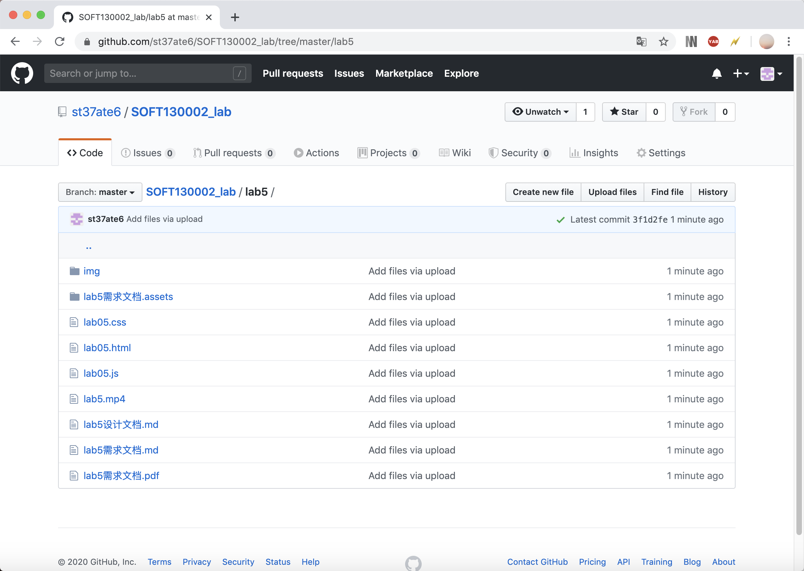
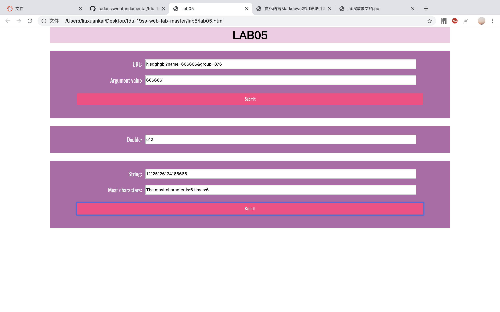

lab5 设计文档
===
19302010086 刘亘恺
----
github截图:

完成网页效果截图：

**URL解析**  
           创建一个 `a` 元素，将其 href 属性设置为待解析的 URL，获取到查询部分。
           再应用 `URLSearchParams` 中的 `get("name")` 方法获取 `name` 值。

**定时加倍设定**  
           `window.onload`页面加载完毕后，调用方法`setInterval（）`每5000ms执行一次方法。起始`mul.value` = 1，方法中先进行判断（次数超过10或者整分则停止翻倍）。
           利用`clearInterval（）`取消间歇调用。

**字符分析统计**  
            通过 `split(char)` 方法可以将字符串分割为其出现个数+1段。
            这样可得该字符出现次数，遍历所有字符即可找出出现最频繁的字符和其出现次数。